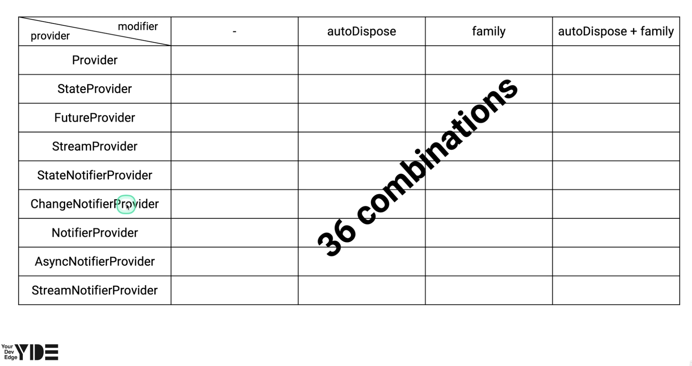

# all_providers

**riverpod의 9가지 Provider**
1. Provider
2. StateProvider
3. StateNotifierProvider
4. ChangeNotifierProvider
5. NotifierProvider
6. AsyncNotifierProvider
7. FutureProvider
8. StreamProvider
9. StreamNotifierProvider

**Provider Modifiers**
- none
- autoDispose
- family 
- autoDispose + family

## Provider
- `Provider`는 riverpod에서 제공히는 provider들 중에서 가장 기본 
- `Provider`는 값을 생성함(생성밖에 못함)
- 기본적인 용도는 위젯이나 다른 `Provider`에게 값을 제공

### Provider for value overriding 
1. 개발에는 FakeRepository, 배포에는 RealRepository 사용
2. 비동기식으로 initial이 필요한 인스턴스를 Provider로 제공
3. 성능 최적화. rebuild 할 요소들을 최소화 시킴

