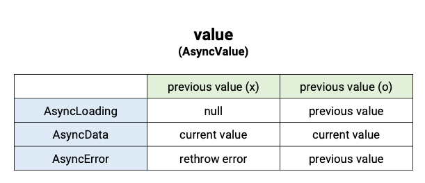
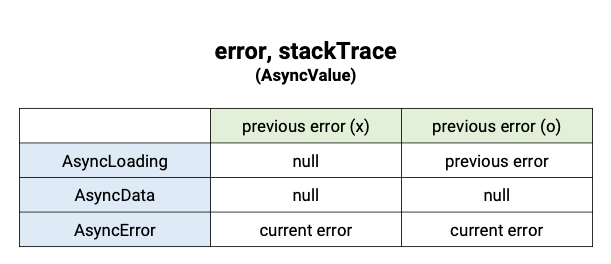
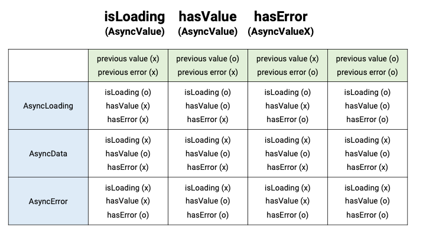

# AsyncValue Details


### Property 
- **value** <br>
 <br>
각 상태별 `previous value`의 유무에 따른 `value` 값을 나타낸다.
`AsyncValue`가 한번이라도 `value`를 갖게되면 null이나 error를 발생시키지 않는다.


- **error, stackTrace** <br>
 <br>
  각 상태별 `previous error`의 유무에 따른 `error` 값을 나타낸다.
`AsyncLoading`일 때는 이전 에러가 존재할 때만 `error`를 갖는다.
`AsyncData`일 때는 데이터를 성공적으로 가져왔기 때문에 `error`를 가지고있을 필요가 없다.
`AsyncError`일 때는 항상 에러 값을 가지고 있는다.

  
- **isLoading, hasValue, hasError** <br>
 <br>
`isLoading`, `hasValue`는 `AsyncValue`의 Property이고, `hasError`는 `AsyncValueX`의 Property이다.
  - `isLoading`은 현재 값이 비동기적으로 값을 가져오고 있으면 **true**를 갖는다.
  - `hasValue`는 `value` Property가 값을 가지고 있으면 **true**를 갖는다. 현재 로딩 상태이거나 에러 상태여도 이전에 가져온 데이터가 있으면 **true**이다.
  - `hasError`는 `error` Property가 null이 아니면 **true**이다. 데이터를 가져오고 있어도 이전에 에러가 발생했으면 **true**이다. (`AsyncData`상태가 되면 `error`가 null이 되므로 **false**가 된다.)
상태와 다르게 위 세 값은 모두 true일 수 있다. 

<br><br>
**isReloading**
```dart
bool get isReloading => (hasValue || hasError) && this is AsyncLoading;
```
`isReloading`은 hasValue나 hasError가 true이며 AsyncLoading 상태여야 한다. 즉, 처음 데이터를 불러올 때는 `isLoading`은 true지만 `isReloading`은 false이다. 
<br><br>
e.g.) `FutureProvider`가 `ref.watch`를 통해서 다른 Provider를 watch하는 경우. `FutureProvider`가 의존하는 provider의 state가 변하게되면 `FutureProvider`가 rebuild 되면서 값을 다시 요청하게된다. <br>
Provider가 rebuild 되는 경우는 `ref.refresh`나 `ref.invalidate`되는 경우에 발생하게 된다. 이때는 provider가 dispose되었다가 rebuild 되므로 `isReloading`은 **false**가 되고 `isRefreshing`이 **true**가 된다.
<br><br>
**isRefreshing**
```dart
bool get isRefreshing =>
    isLoading && (hasValue || hasError) && this is! AsyncLoading;
```
한 provider가 의존하는 다른 provider가 변하지 않았어도 `ref.refresh`나 `ref.invalidate`가 호출되면서 provider가 강제로 rebuild 될 때 true가 된다. <br>
단, 한 번이라도 데이터를 불러온 후에 true가 된다. (`hasValue || hasError`)
<br><br>
**valurOrNull**
```dart
T? get valueOrNull {
  if (hasValue) return value;
  return null;
}
```
state가 값을 가지고 있으면 해당 값을 반환한다. `AsyncData`에서는 무조건 value를 반환하고, `AsyncLoading`이나 `AsyncError`일 때는 previous value가 없으면 null을 반환한다.
<br><br>
**requireValue**
```dart
T get requireValue {
  if (hasValue) return value as T;
  if (hasError) {
    throwErrorWithCombinedStackTrace(error!, stackTrace!);
  }

  throw StateError(
    'Tried to call `requireValue` on an `AsyncValue` that has no value: $this',
  );
}
```
`requireValue`는 UI에서 `AsyncValue`값이 null이 아닐 때만 안전하게 사용 가능하다. `hasError` 상태에서는 현재 에러를 rethrow하고 이외에는 `StateError`를 발생시킨다.


<br><br>
# [AsyncValueX](https://pub.dev/documentation/riverpod/latest/riverpod/AsyncValueX.html)
`AsyncValue` 확장 메소드로 `when`,`whenData`,`whenOrNull`, `mapOrNull`,`maybeMap`,`maybeWhen` 이 있다.  

<br><br>
**when**
```dart
R when<R>({
  bool skipLoadingOnReload = false,
  bool skipLoadingOnRefresh = true,
  bool skipError = false,
  required R Function(T data) data,
  required R Function(Object error, StackTrace stackTrace) error,
  required R Function() loading,
}) {
  if (isLoading) {
    bool skip;
    if (isRefreshing) {
      skip = skipLoadingOnRefresh;
    } else if (isReloading) {
      skip = skipLoadingOnReload;
    } else {
      skip = false;
    }
    if (!skip) return loading();
  }

  if (hasError && (!hasValue || !skipError)) {
    return error(this.error!, stackTrace!);
  }

  return data(requireValue);
}
```
`when`은 data, error, loading callback을 필수 값으로 받아서 해당 상태에 따른 화면을 보여준다. 

`skipLoadingOnReload`은 `isReloading`이 **true**일 때 값에 따라서 loading callback을 실행할 것인지 스킵할 것인지를 결정한다. 

`skipLoadingOnRefresh`는 provider가 `ref.refresh`, `ref.invalidate`로 rebuild될 때 loading callback을 호출할 것인지를 결정한다. 

`skipError`는 previousValue가 null이 아니면 error callback을 보여주지 않고 data callback을 표시할 것인지를 결정한다.


<br><br>
**maybeWhen**
```dart
R maybeWhen<R>({
  bool skipLoadingOnReload = false,
  bool skipLoadingOnRefresh = true,
  bool skipError = false,
  R Function(T data)? data,
  R Function(Object error, StackTrace stackTrace)? error,
  R Function()? loading,
  required R Function() orElse,
}) {
  return when(
    skipError: skipError,
    skipLoadingOnRefresh: skipLoadingOnRefresh,
    skipLoadingOnReload: skipLoadingOnReload,
    data: data ?? (_) => orElse(),
    error: error ?? (err, stack) => orElse(),
    loading: loading ?? () => orElse(),
  );
}
```
`maybeWhen`은 data, error, loading은 전부 optional인 반면에 orElse는 필수이다. `maybeWhen`은 data callback은 따로 처리하고 error와 loading callback을 묶어서 처리할 때 유용하다.  


<br><br>
**whenOrNull**
```dart
R? whenOrNull<R>({
  bool skipLoadingOnReload = false,
  bool skipLoadingOnRefresh = true,
  bool skipError = false,
  R? Function(T data)? data,
  R? Function(Object error, StackTrace stackTrace)? error,
  R? Function()? loading,
}) {
  return when(
    skipError: skipError,
    skipLoadingOnRefresh: skipLoadingOnRefresh,
    skipLoadingOnReload: skipLoadingOnReload,
    data: data ?? (_) => null,
    error: error ?? (err, stack) => null,
    loading: loading ?? () => null,
  );
}
```
`whenOrNull`은 모든 callback이 option이다. 특정 callback만 처리하고 나머지는 무시할 때 유용하다.

<br><br>
**map** & **maybeMap** & **mapOrNull**
```dart
R map<R>({
  required R Function(AsyncData<T> data) data,
  required R Function(AsyncError<T> error) error,
  required R Function(AsyncLoading<T> loading) loading,
});
```
```dart
R maybeMap<R>({
  R Function(AsyncData<T> data)? data,
  R Function(AsyncError<T> error)? error,
  R Function(AsyncLoading<T> loading)? loading,
  required R Function() orElse,
}) {}
```
```dart
R? mapOrNull<R>({
  R? Function(AsyncData<T> data)? data,
  R? Function(AsyncError<T> error)? error,
  R? Function(AsyncLoading<T> loading)? loading,
}) {}
```
형태는 `when`과 비슷하지만, skip 계열의 argument를 제공하지 않는다.
<br><br>


### map vs when
```dart
R when<R>({
  bool skipLoadingOnReload = false,
  bool skipLoadingOnRefresh = true,
  bool skipError = false,
  required R Function(T data) data,
  required R Function(Object error, StackTrace stackTrace) error,
  required R Function() loading,
});
```
`when`의 경우에는 상태에 따라 각각의 argument를 받는 callback 함수를 제공하여 [argument destructuring](https://medium.com/@ethiel97/practical-guide-to-destructuring-typescript-vs-dart-40e1fe3baf2a)형태를 띈다.
<br><br>
```dart
R map<R>({
  required R Function(AsyncData<T> data) data,
  required R Function(AsyncError<T> error) error,
  required R Function(AsyncLoading<T> loading) loading,
});
``` 
반면 `map`은 각각에 AsyncData, AsyncError, AsyncLoading 인스턴스를 argument로 제공한다. argument로 제공된 객체로 추가 작업을 할 때 유용하다.

<br><br>

### [copyWithPrevious](https://pub.dev/documentation/riverpod/latest/riverpod/AsyncValue/copyWithPrevious.html)
```dart
AsyncValue<T> copyWithPrevious(
  AsyncValue<T> previous, {
  bool isRefresh = true,
});
```
`copyWithPrevious`는 `AsyncValue`에서 abstract하게 작성 되고, 각각 `AsyncData`, `AsyncError`, `AsyncLoading`에서 구현한다. `AsyncValue`가 상태가 변할 때 이전 속성을 유지하는 것은 이 속성 때문이다.


**AsyncData**
```dart
@override
AsyncData<T> copyWithPrevious(
  AsyncValue<T> previous, {
  bool isRefresh = true,
}) {
  return this;
}
```


**AsyncError**
```dart
@override
AsyncError<T> copyWithPrevious(
  AsyncValue<T> previous, {
  bool isRefresh = true,
}) { 
  return AsyncError._(
    error,
    stackTrace: stackTrace,
    isLoading: isLoading,
    value: previous.valueOrNull,
    hasValue: previous.hasValue,
  );
}
```

**AsyncLoading**
```dart
@override
AsyncValue<T> copyWithPrevious(
  AsyncValue<T> previous, {
  bool isRefresh = true,
}) {
  if (isRefresh) {
    return previous.map(
      data: (d) => AsyncData._(
        d.value,
        isLoading: true,
        error: d.error,
        stackTrace: d.stackTrace,
      ),
      error: (e) => AsyncError._(
        e.error,
        isLoading: true,
        value: e.valueOrNull,
        stackTrace: e.stackTrace,
        hasValue: e.hasValue,
      ),
      loading: (_) => this,
    );
  } else {
    return previous.map(
      data: (d) => AsyncLoading._(
        hasValue: true,
        value: d.valueOrNull,
        error: d.error,
        stackTrace: d.stackTrace,
      ),
      error: (e) => AsyncLoading._(
        hasValue: e.hasValue,
        value: e.valueOrNull,
        error: e.error,
        stackTrace: e.stackTrace,
      ),
      loading: (e) => e,
    );
  }
}
```
`AsyncLoading`에서 구현은 **isRefresh** 값에 따라서 나뉜다. 
<br><br>
### [ref.refresh vs ref.invalidate](https://riverpod.dev/docs/essentials/faq)
