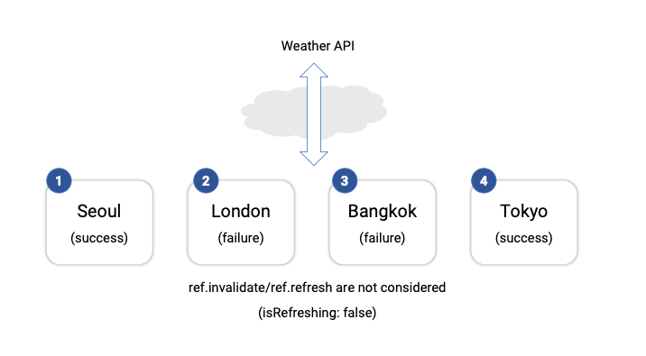
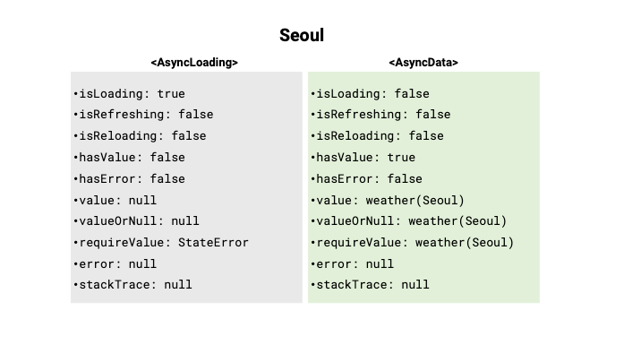
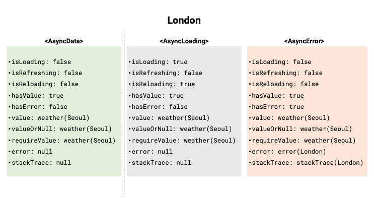
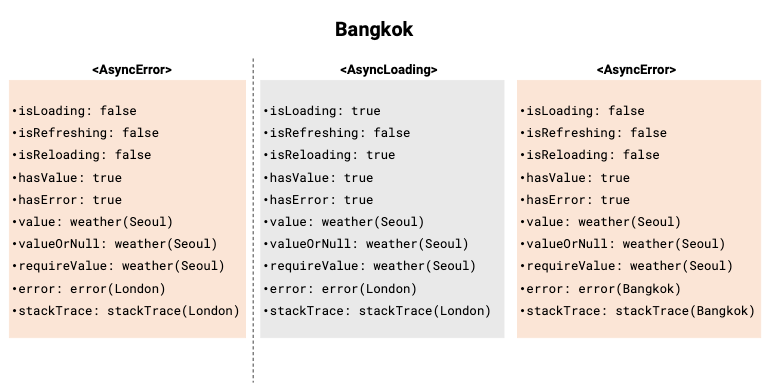
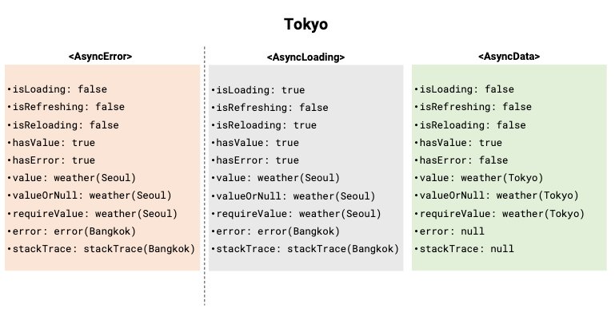

# [Weather API](https://openweathermap.org/api)
AsyncNotifierProvider & AsyncValue 를 사용한 API 통신

### Test Scenario

  
Scenario

Weather API를 각 나라의 도시별로 호출하여 서울과 도쿄에서는 API의 호출을 성공 시키고 런던과 방콕에서는 실패 시킨다.  

1. Seoul 날씨 호출
   
   Seoul의 날씨를 호출하면 상태는 `AsyncLoading`에서 `AsyncData`로 바뀌고 **value**안에 Seoul 날씨가 들어간다.
     
2. London 날씨 호출
   
   London의 날씨 호출은 실패하게되므로 상태가 `AsyncLoading`에서 `AsyncError`로 변경된다. 그리고 **value**는 Seoul 날씨로 유지되고 **error**에는 London에서 발생한 오류가 저장된다.
     
3. Bangkok 날씨 호출
   
   Bangkok의 날씨 호출도 실패하게 되므로 상태가 `AsyncLoading`에서 `AsyncError`로 다시 변경되고, **value**는 Seoul 날씨로 유지되고 **error**에는 Bangkok에서 발생한 오류로 변경된다.
     
4. Tokyo 날씨 호출
   
  Tokyo의 날씨 호출은 성공하므로 `AsyncLoading`에서 `AsyncData`로 바뀌면서 **error**는 사라지고 **value**안에 Seoul 날씨가 들어간다.

