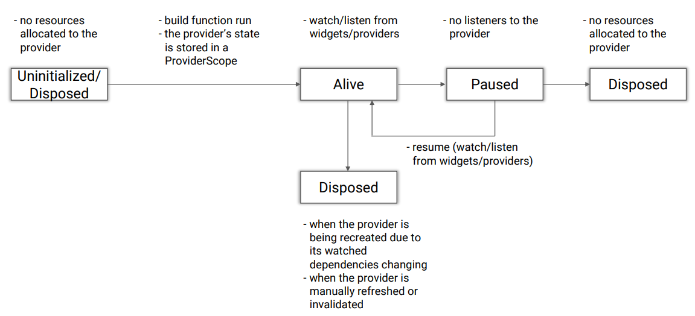
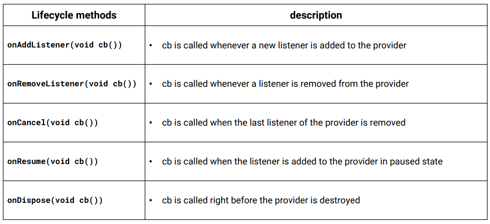
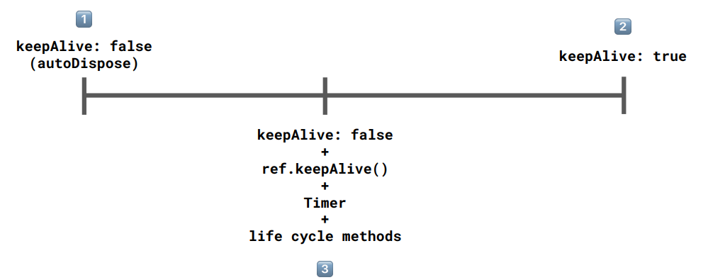

# [Provider LifeCycle](https://riverpod.dev/docs/concepts/provider_lifecycles)

- Uninitialized/Disposed: Provider가 아무 리소스도 할당받지 못한 상태
  - Creating -> Alive : build Function이 실행 되고 Provider의 상태는 ProviderScope에 저장됨 
- Alive : Widget 또는 다른 Provider에 의해서 watch/listen 되고 있는 상태 
  - Alive에서 state가 변함에 따라 의존하는 Widget/Provider이 rebuild 됨
  - KeepAlive에 따라서 Paused(true) / Disposed(false) 로 변한다. 
- Paused : Alive Provider가 다른 Widget/Provider에 의헤 listen 되지 않을 때 
  - Alive <-> Paused : Provider를 listen이 되어지거나 되어지지 않을 때 상태 변화 
- Disposed : 메모리에서 제거되고, 리소스를 할당받지 않은 상태
  - Alive -> Disposed / Paused -> Disposed로 상태가 변한다.  
  - Disposed 되는 3가지 이유
    - autoDispose에 의해서 
    - invalidate/refresh에 의해서
    - watch/listen하는 Provider의 state 변화에 의해서 

## Ref에서 제공하는 LifeCycle Methods

## Caching Provider

1. autoDispose되는 Provider
2. KeepAlive
3.  ref.keepAlive()와 Timer를 이용해서 일정 시간이 지나면 Dispose되는 Provider 

## LifeCycle Test
### 1, keepAlive: false (AutoDispose)

### 2. keepAlive: true

### 3. keepAlive: false + ref.keepAlive() + Timer + lifecycle methods (sync)

### 4. keepAlive: false + ref.keepAlive() + Timer + lifecycle methods (async)

### 5. when a provider watches another provider