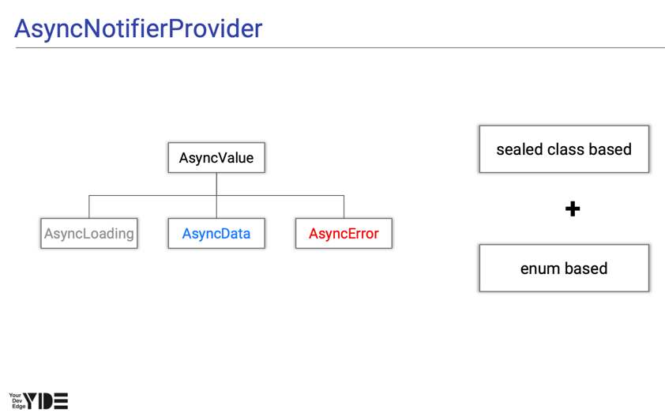

# AsyncNotifierProvider
`NotifierProvider`가 `Notifier`의 변화를 감지하는 것 처럼 `AsyncNotifierProvider`는 `AsyncNotifier`의 변화를 감지하고 노출하는데 사용되는 `Provider`

riverpod에서 복잡한 business logic을 다루어야할 경우 Notifier, AsyncNotifier 사용을 권장한다. 

`AsyncNotifierProvider`는 외부에서 state를 읽을 수는 있지만 변경할 수는 없는 immutable한 state를 제공한다. 

state를 변경하기 위해서는 `AsyncNotifier`에서 제공되는 인터페이스를 통해서만 데이터 변경이 가능하다. 

`AsyncNotifierProvider`가 `NotifierProvider`와 다른 점은 비동기적으로 초기화되는 `Notifier`라고 볼 수 있다.


`AsyncNotifierProvider`에서는 `AsyncValue`값을 사용하여 상태를 관리하고, sealed class와 enum의 특성을 합친 것과 비슷하다. 

### when
```dart
R when<R>({
  bool skipLoadingOnReload = false,
  bool skipLoadingOnRefresh = true,
  bool skipError = false,
  required R data( T data ),
  required R error( Object error, StackTrace stackTrace ),
  required R loading(),
})
```
`when`은 `AsyncValue`의 확장 함수로 `AsyncValue`가 `data`, `error`, `loading` 상태일 때 표시할 위젯을 나타내도록 한다. 
<br>
`error`의 stackTrance를 직접 전달할 수 없을 때는 `StackTrace.current`를 전달하면 된다. 
<br>
`skipLoadingOnRefresh`를 `true`로 주면 `provider`를 `invalidate` 했을 때 로딩 화면을 표시할 수 있다.
