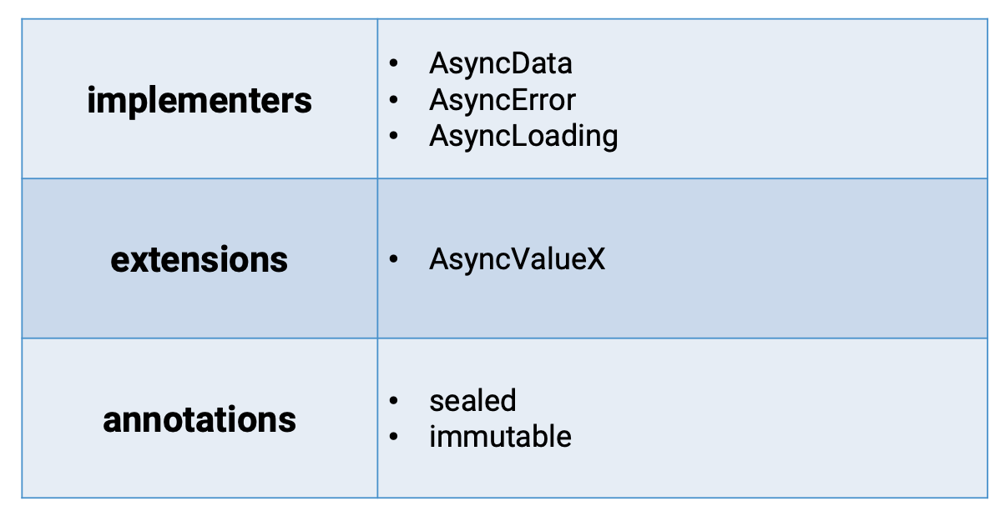

# FutureProvider
`AsyncValue`가 지원되는 `Provider`. `FutureBuilder`의 대용으로 사용 가능하다

통상적으로 Remote Api 호출에서는 Loading / Success / Error 의 상태 처리가 필요하다. 
Riverpod에서는 `AsyncValue`를 지원하여 위 세 상태를 다루기 편하게 한다.

### AsyncValue

- `AsyncLoading`: `AsyncValue.loading` progress indicator
- `AsyncError` : `AsyncValue.error` error screen
- `AsyncData` : `AsyncValue.data` show the data
```dart
// constructor redirection
const factory AsyncValue.data(T value) = AsyncData<T>;
const factory AsyncValue.error(Obejct error, StackTrace stackTrace) = AsyncError<T>;
const factory AsyncValue.loading() = AsyncLoading<T>;
```

**Sealed Annotation**
`@sealed`
컴파일 시 해당 어노테이션이 있으면 해당 클래스의 subclass를 알 수 있다.
`is` operator를 사용하지 않아도 된다. 
즉 `switch` / `when` / `map` 등을 사용할 수 있다. 

**when**
data, error, loading 처리를 콜백으로 받는다. 
```dart
R when<R>({
  skipLoadingOnReload = false,
  skipLoadingOnRefresh = true,
  skipError = false,
  required R Function(T data) data,
  required R Function(Object error, StackTrace stackTrace) error, required R Function() loading,
})
```
FutureProvider / StreamProvider / AsyncNotifierProvider와 같이 사용된다.

<details>
  <summary>when 예제</summary>

  ```dart
body: switch (userList) {
  AsyncData(value: final users) => ListView.separated(
    itemCount: users.length,
    separatorBuilder: (context, index) {
      return const Divider();
    },
    itemBuilder: (context, index) {
      final user = users[index];
      return ListTile(
        leading: CircleAvatar(
          child: Text(user.id.toString()),
        ),
        title: Text(user.name),
      );
    },
  ),
  AsyncError(error: final error, stackTrace: final _) => Center(
          child: Text(
            error.toString(),
            style: const TextStyle(fontSize: 20, color: Colors.red),
          ),
        ),
  // AsyncLoading() => const Center(
  // switch case에서 default와 동일
  _ => const Center(
          child: CircularProgressIndicator(),
        ),
},
  ```
</details>
<details>
  <summary>switch 예제</summary>

  ```dart
body: userList.when(
  data: (users) {
    return ListView.separated(
      itemCount: users.length,
      separatorBuilder: (context, index) {
        return const Divider();
      },
      itemBuilder: (context, index) {
        final user = users[index];
        return ListTile(
          leading: CircleAvatar(
            child: Text(user.id.toString()),
          ),
          title: Text(user.name),
        );
      },
    );
  },
  error: (error, stackTrace) {
    return Center(
      child: Text(
        error.toString(),
        style: const TextStyle(fontSize: 20, color: Colors.red),
      ),
    );
  },
  loading: () => const Center(
    child: CircularProgressIndicator(),
  ),
),
  ```
</details>

