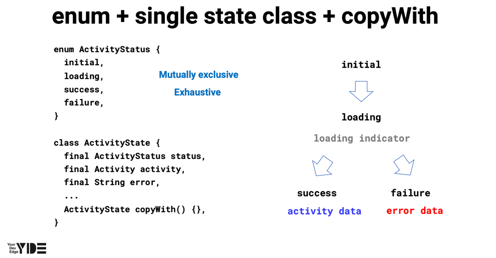
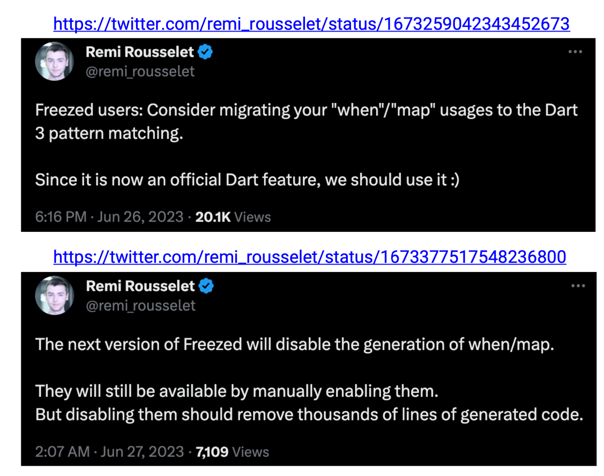

# NotifierProvider
 `Notifier`를 쉽게 접근할 수 있게 해주고 `Notifier`의 state 변화를 listen 하는 Provider.
 
복잡한 **Business Logic**에 사용하는 것을 추천함

`Notifier`에서 제공하는 **interface**에서만 수정 가능한 **state**를 제공

`Notifier`의 **state**는 동기적으로 초기화됨. 비동기적으로 초기화 하려면 `AsyncNotifier` 사용

riverpod_generator를 사용해 생성 가능
  

## State Shape 
### enm based state

**ActivityStatus**: 현재 통신 상태를 나타낸다.
  - initial : 초기 상태.
  - loading : 데이터를 받고있는 상태, 보통 loading indicator를 표시 
  - success : 데이터 수신이 정상적으로 완료된 상태, 화면을 표시한다. 
  - failure : 데이터 수신이 비정상적으로 실패한 상태, 보통 실패 화면이나 다이얼로그를 띄운다.
**Actvity**: 데이터 수신 성공 시 현재 데이터를 표시
**error**: 데이터 수신 실패 시 에러 메시지를 표시

### sealed class based state
  - Dart 3.0 부터 제공

freezed

freezed에서는 자체적으로 sealed/union class를 제공하는데, dart에서 이제 제공하므로 사용할 필요가 없음

### AsyncValue
riverpod에 특화된 state shape

